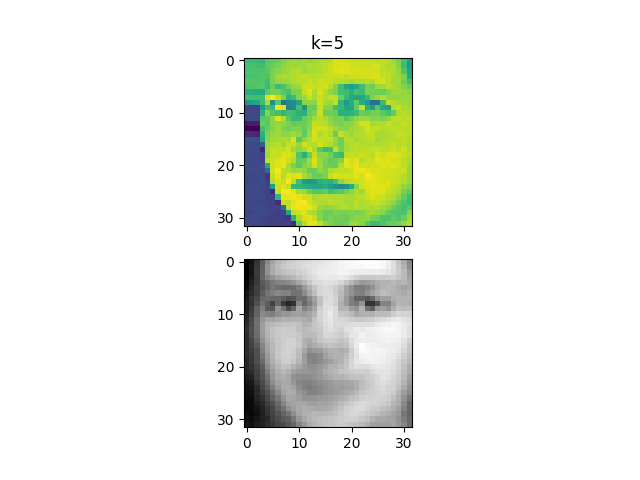
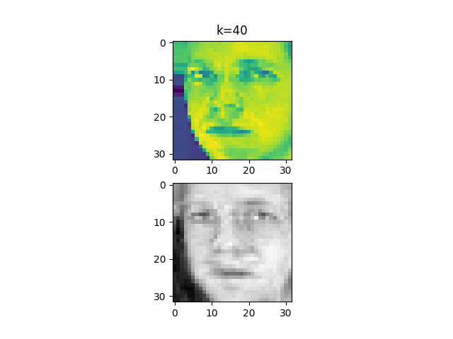
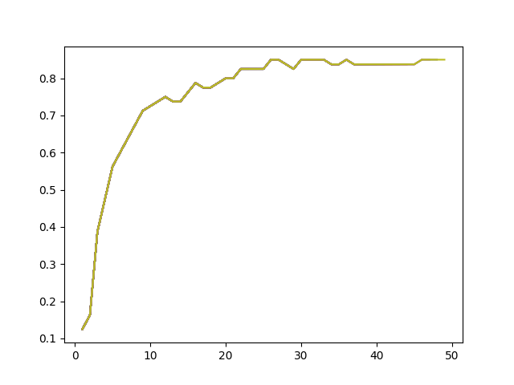

# PCA-FaceDecomposition

A simple implementation of principal component analysis(PCA) for face recognition, by decomposing a face into k many "eigenfaces", i. e. we decompose the data points the first k planes with largest variance.

See this classic paper for a more detailed discussion: 
https://www.cs.ucsb.edu/~mturk/Papers/mturk-CVPR91.pdf

The followings are comparisons between the original face and the eigenface-reconstructed faces with k-PCA.  

When we have k=20, the reconstruction becomes much more accurate:  

We also use this on face recognition, the ploted is the accuracy of recognition versus k.

